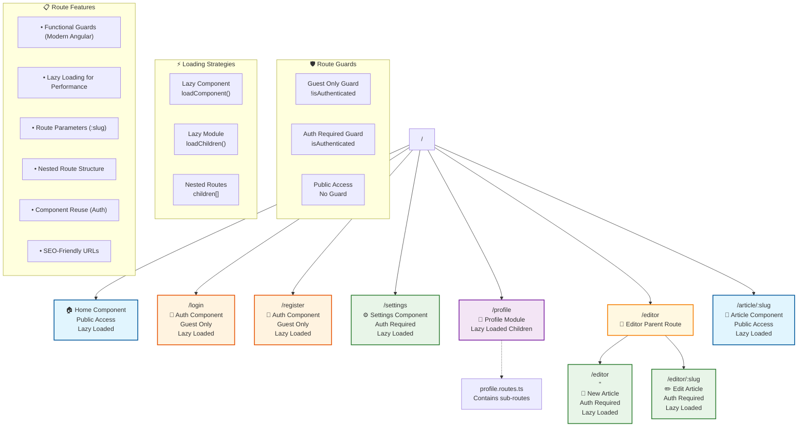

# Routes

```mermaid
graph TB
    %% Root Application
    Root["/"] --> Home["🏠 Home Component<br/>Public Access<br/>Lazy Loaded"]

    %% Authentication Routes
    Root --> Login["/login<br/>🔐 Auth Component<br/>Guest Only<br/>Lazy Loaded"]
    Root --> Register["/register<br/>📝 Auth Component<br/>Guest Only<br/>Lazy Loaded"]

    %% Protected Routes
    Root --> Settings["/settings<br/>⚙️ Settings Component<br/>Auth Required<br/>Lazy Loaded"]

    %% Profile Module (Lazy Loaded Children)
    Root --> ProfileModule["/profile<br/>👤 Profile Module<br/>Lazy Loaded Children"]
    ProfileModule -.-> ProfileRoutes["profile.routes.ts<br/>Contains sub-routes"]

    %% Editor Nested Routes
    Root --> EditorParent["/editor<br/>📝 Editor Parent Route"]
    EditorParent --> EditorNew["/editor<br/>''<br/>📄 New Article<br/>Auth Required<br/>Lazy Loaded"]
    EditorParent --> EditorEdit["/editor/:slug<br/>✏️ Edit Article<br/>Auth Required<br/>Lazy Loaded"]

    %% Article Detail Route
    Root --> ArticleDetail["/article/:slug<br/>📖 Article Component<br/>Public Access<br/>Lazy Loaded"]

    %% Guards Legend
    subgraph "🛡️ Route Guards"
        GuestOnly["Guest Only Guard<br/>!isAuthenticated"]
        AuthRequired["Auth Required Guard<br/>isAuthenticated"]
        PublicAccess["Public Access<br/>No Guard"]
    end

    %% Loading Strategy Legend
    subgraph "⚡ Loading Strategies"
        LazyComponent["Lazy Component<br/>loadComponent()"]
        LazyModule["Lazy Module<br/>loadChildren()"]
        NestedRoute["Nested Routes<br/>children[]"]
    end

    %% Route Types Color Coding
    classDef publicRoute fill:#e1f5fe,stroke:#01579b,stroke-width:2px
    classDef guestRoute fill:#fff3e0,stroke:#e65100,stroke-width:2px
    classDef protectedRoute fill:#e8f5e8,stroke:#2e7d32,stroke-width:2px
    classDef moduleRoute fill:#f3e5f5,stroke:#7b1fa2,stroke-width:2px
    classDef nestedRoute fill:#fff8e1,stroke:#f57c00,stroke-width:2px

    %% Apply Styles
    class Home,ArticleDetail publicRoute
    class Login,Register guestRoute
    class Settings,EditorNew,EditorEdit protectedRoute
    class ProfileModule moduleRoute
    class EditorParent nestedRoute

    %% Notes
    subgraph "📋 Route Features"
        Feature1["• Functional Guards (Modern Angular)"]
        Feature2["• Lazy Loading for Performance"]
        Feature3["• Route Parameters (:slug)"]
        Feature4["• Nested Route Structure"]
        Feature5["• Component Reuse (Auth)"]
        Feature6["• SEO-Friendly URLs"]
    end
```
